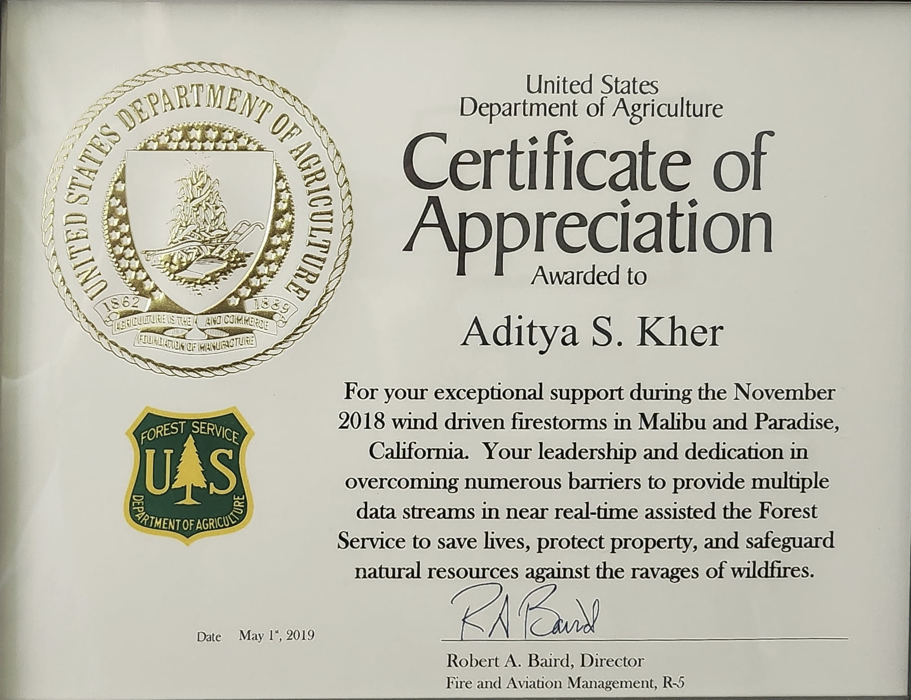

### Missile Warning Algorithms

: Lockheed Martin / U.S. Space Force (public domain).](files/150515-F-ZZ999-111_reduced.jpg){#fig-sbirs width=50% fig-alt="Artist's rendering of a SBIRS satellite in orbit above Earth"}

At [Northrop Grumman](https://www.northropgrumman.com), I worked on the ground system for the [US Space Force's](https://www.spaceforce.mil/) [DSP](https://missilethreat.csis.org/defsys/dsp/) and [SBIRS](https://missilethreat.csis.org/defsys/sbirs/) missile warning satellite constellations. Collectively known as Overhead Persistent Infrared (OPIR), these satellites are equipped with [infrared](https://en.wikipedia.org/wiki/Infrared) sensors that can detect the heat signatures of missile launches from space. The ground system processes the data from the satellites in order to identify and track potential missile threats, and to provide early warning to authorities. This data is also used for [technical intelligence](https://en.wikipedia.org/wiki/Technical_intelligence) and [situational awareness](https://en.wikipedia.org/wiki/Situation_awareness), and plays a critical role in cueing [missile defense](https://en.wikipedia.org/wiki/Missile_defense) systems.

I was part of an R&D team focused on figuring out how to respond to novel, advanced threats. This involved extensive data analysis from the OPIR sensors on threat characteristics, which was then used to inform the development of a real-time, physics-based algorithm to provide warning against these threats. This algorithm incorporated numerical simulation of threat trajectories and could execute in a timely and accurate manner during real-world missile events. An initial version of the algorithm was rapidly developed and deployed to the operational ground system in the span of a year, and after that was continuously improved via model fidelity enhancements and parameter tuning as more data was collected from real-world events. Going from research to operations so quickly was a unique and rewarding experience, especially given the critical nature of the application.

This work is now an important part of the national security infrastructure. It was presented at several conferences, winning a Best Poster award at one, and was additionally a key contributor to a $200M+ [contract award](https://web.archive.org/web/20251226112054/https://www.govconwire.com/articles/northrop-gets-223m-contract-to-sustain-defense-support-program-satellites).

### Wildfire Detection and Monitoring

In addition to missile launches, OPIR satellites have the ability to detect wildfires, which also emit infrared radiation. As a civil mission with enormous potential impact, there have been efforts dating back decades to support OPIR [dual-use](https://en.wikipedia.org/wiki/Dual-use_technology) in fighting wildfires, as extensively reported by [The New York Times](https://www.nytimes.com/2021/09/27/science/wildfires-military-satellites.html). Unlike NASA's civilian [Earth observation satellites](https://firms.modaps.eosdis.nasa.gov/), which have revisit times of several hours, DSP for example has a revisit time of 10 seconds, which would allow for near real-time monitoring of wildfire activity. This capability would be especially important for early detection of wildfires, which can help to prevent spreading and causing damage to property and loss of life. Due to security concerns, however, OPIR data has not been widely available for wildfire monitoring.

At Northrop Grumman I was part of a team working with the [US Forest Service](https://www.fs.fed.us/) to provide a potential wildfire detection and monitoring capability using OPIR data. This involved developing algorithms to efficently process wildfire detection data in real time. In particular, I developed an [unsupervised learning](https://en.wikipedia.org/wiki/Unsupervised_learning) algorithm to cluster OPIR data into distinct wildfire events, which could then be tracked over time to monitor the growth and spread of the fire. The clusters also generated near-real-time fire perimeters, which are critical for firefighting efforts and provided a drastic improvement over the standard once-per-day fire perimeters that firefighters [typically produce](https://www.nifc.gov/fire-information/maps) on an active incident.

.](files/california_tmo_2018313_lrg_reduced.jpg){#fig-california-fires width=80% fig-alt="Natural-color satellite image of California showing large smoke plumes from the Camp Fire in the north and the Hill and Woolsey Fires in the south, spreading west over the Pacific"}

In November 2018, during critical fire-risk weather conditions, the Forest Service issued an urgent request for OPIR support for their wildfire response in California. The Space Force, who owns the satellites and data, gave an [unprecedented approval](https://web.archive.org/web/20200813081834/https:/www.afspc.af.mil/News/Article-Display/Article/1959289/improving-lives-maximizing-taxpayer-dollars-with-dual-use-space-capabilities/) to use OPIR for this purpose, and our team set up an operational data pipeline literally overnight to rapidly provide wildfire detection and monitoring information to the Forest Service. Not only was our data and software used, but Northrop Grumman staff, including myself, executed the 24/7 operational mission of monitoring the data and providing it to the Forest Service. The [wildfires of that season](https://en.wikipedia.org/wiki/2018_California_wildfires) were some of the deadliest and most destructive on record, and our team was credited with preventing the spread of four additional fires.

{#fig-forest-service-certificate width=50% fig-alt="Certificate of Appreciation from the US Forest Service for support during the 2018 California wildfires"}

This was an immensely rewarding experience, not only due to the direct societal impact, but also because it was a unique opportunity to be part of a live operational mission with immediate consequences, providing a window into the experience of the Space Force's OPIR missile warning operators, for example. This work was recognized by the Forest Service, and also won a Northrop Grumman sector-level President's Award.

### Hyperspectral Environmental Analysis Algorithms

[Hyperspectral imaging](https://en.wikipedia.org/wiki/Hyperspectral_imaging) is a powerful remote sensing technique that captures a wide range of wavelengths across the visible and infrared spectrum, providing detailed information about the composition and properties of objects and materials. This technology has applications in a variety of fields, including agriculture, environmental monitoring, and defense. At Northrop Grumman I was part of a pathfinding [R&D project](https://web.archive.org/web/20251208192541/https:/www.northropgrumman.com/sustainability/technology-for-conservation/hop-queue) aiming to develop a low-cost, [CubeSat](https://en.wikipedia.org/wiki/CubeSat)-based hyperspectral imaging and analysis platform for environmental monitoring. This was part of the company's enterprise-level [Technology for Conservation](https://web.archive.org/web/20260316164708/https://www.northropgrumman.com/sustainability/technology-for-conservation) initiative, and engaged NASA's [Surface Biology and Geology](https://web.archive.org/web/20260402210005/https://science.nasa.gov/earth-science/decadal-surveys/decadal-sbg/) program as a potential follow-on customer.

We collaborated with [Spectral Sciences, Inc.](https://www.spectral.com/) to leverage a prototype turn-key hyperspectral sensor based on [Corning's](https://www.corning.com/worldwide/en/products/advanced-optics/product-materials/aerospace-defense/remote-sensing.html) microHSI 410 SHARK, which distinguishes 410 spectral bands. With so many bands, the sensor produces a large amount of data, which can be difficult to transmit with the limited bandwidth of a CubeSat downlink. Thus, an integral part of the project was to incorporate onboard processing hardware and software to analyze the hyperspectral data and extract key information before transmission. There were several [data reduction](https://en.wikipedia.org/wiki/Data_reduction) steps in the processing pipeline, including cloud rejection, environmental feature extraction, image chipping, and lossless data compression.

, August 2022.](files/aviris_reduced.jpg){#fig-hopqueue width=80% fig-alt="Results of four normalized-difference indices applied to hyperspectral data from JPL's AVIRIS airborne platform"}

I led a team focused on developing environmental feature extraction algorithms. Our scope spanned algorithm selection, prototyping, and testing. This involved extensive review of hyperspectral analysis methods in the environmental science literature in order to determine the highest-impact analyses to implement. We focused on normalized-difference indices, which exploit the fine spectral resolution provided by the hyperspectral sensor to efficiently extract detailed environmental information. For example, the [normalized difference vegetation index](https://en.wikipedia.org/wiki/Normalized_difference_vegetation_index) (NDVI) is a widely used index that provides information about vegetation health and coverage. We also implemented indices to detect dry, aging vegetation, which can be a wildfire risk factor, as well as active fire and burned area, which can be a risk factor for mudslides during post-fire rains. These calculations effectively reduce the hyperspectral data cube down to a few sparse matrices conveying key environmental information, which can be transmitted much more efficiently to the ground for further analysis and use by stakeholders.

The algorithms were prototyped in [MATLAB](https://www.mathworks.com/products/matlab.html) and tested on data from JPL's [AVIRIS](https://aviris.jpl.nasa.gov/) airborne hyperspectral platform. They were then implemented and rigorously tested in [C++](https://en.wikipedia.org/wiki/C%2B%2B) for deployment on the embedded processing hardware, a [Xilinx Versal](https://www.amd.com/en/products/adaptive-socs-and-fpgas/versal.html) development board. A live ground-based demonstration of the processing pipeline on AVIRIS data was successfully given to stakeholders, including NASA and company leadership, after only a few months of development. Later, we used the Spectral Sciences hyperspectral sensor for an airborne data collection campaign, successfully testing the algorithms on fresh hyperspectral data from the sensor that would be used on the CubeSat.

This work was presented and published at the [SmallSat Conference](https://digitalcommons.usu.edu/smallsat/2022/all2022/141/).