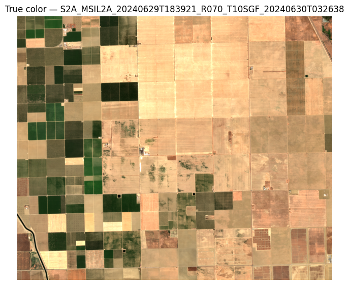
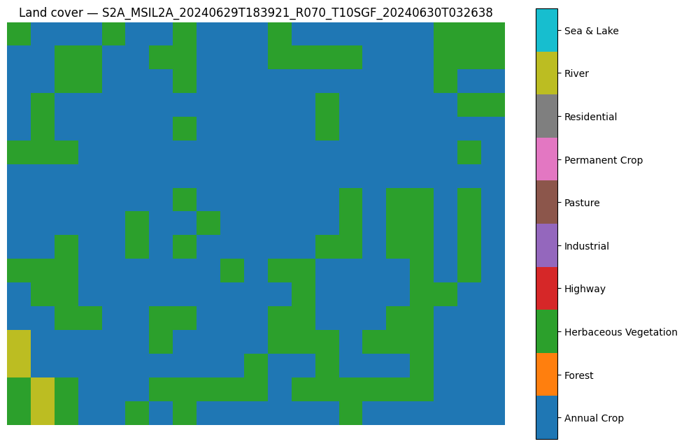
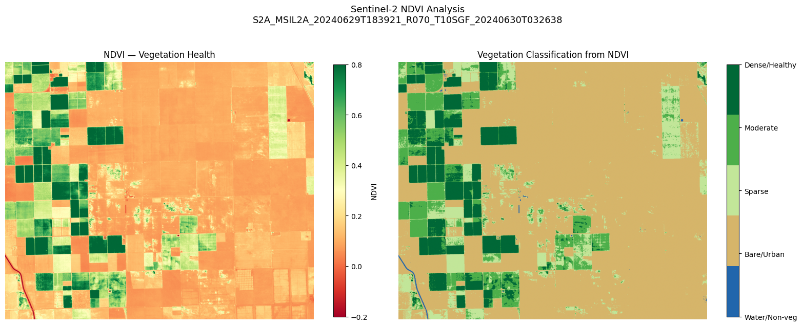
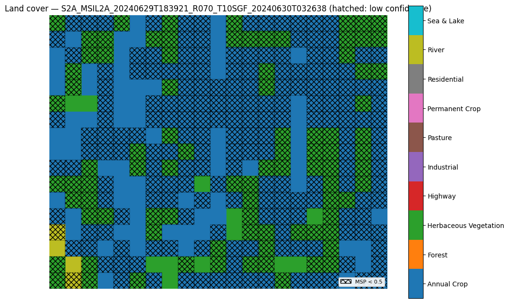
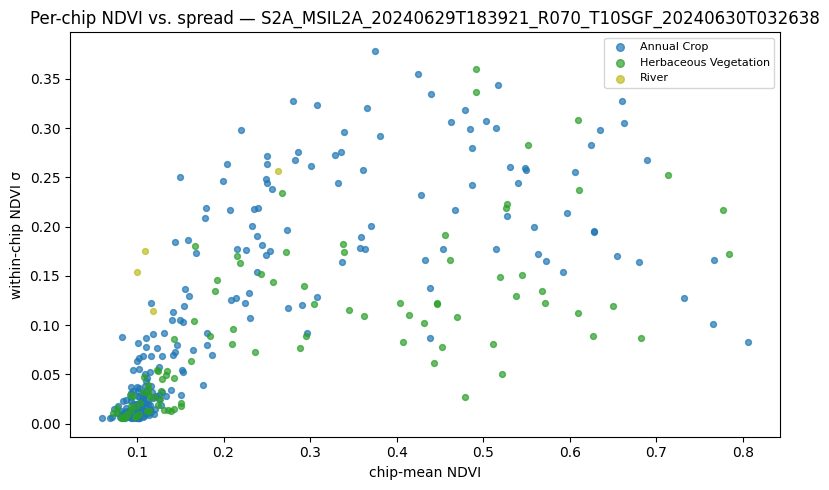
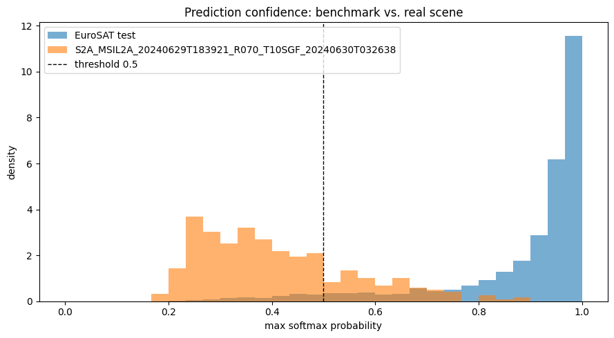
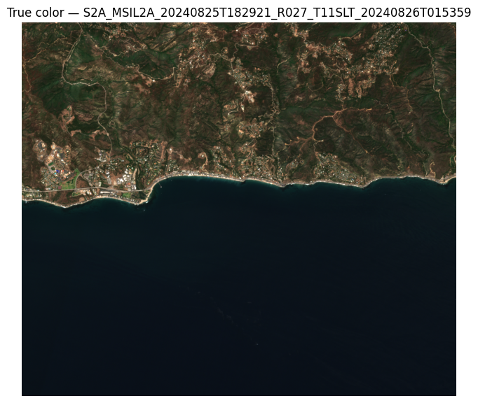
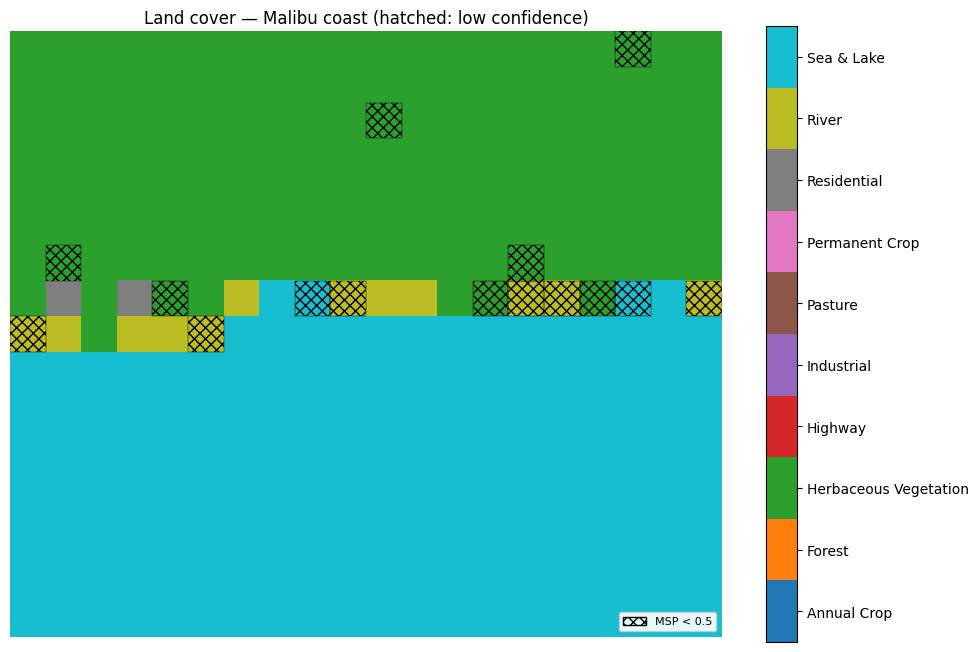
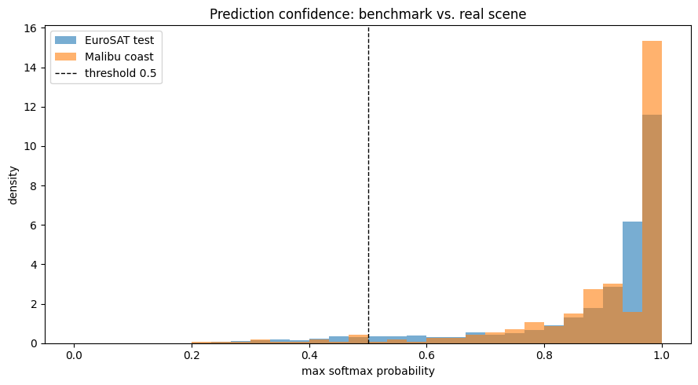

# Benchmark Land-Cover Classification on Operational Sentinel-2 Imagery

This project develops a Python framework for applying a benchmark-trained land-cover classifier to arbitrary operational [Sentinel-2](https://en.wikipedia.org/wiki/Sentinel-2) scenes and characterizing how its performance degrades away from the benchmark. The framework fine-tunes a [ResNet-18](https://en.wikipedia.org/wiki/Residual_neural_network) (Sentinel-2-pretrained) on the ten-class [EuroSAT](https://github.com/phelber/EuroSAT) dataset,[^1] then runs the trained model over full Sentinel-2 Level-2A scenes retrieved from the [Microsoft Planetary Computer](https://planetarycomputer.microsoft.com): bands are harmonized to the EuroSAT radiometric and spectral convention, tiled into 64×64 chips, classified with per-chip confidence, and reassembled into a georeferenced land-cover map. An independent, physics-based [NDVI](https://en.wikipedia.org/wiki/Normalized_difference_vegetation_index) computation on the same scene provides a second opinion, and the per-chip maximum [softmax](https://en.wikipedia.org/wiki/Softmax_function) probability provides an out-of-distribution signal. We apply the framework to two contrasting scenes — an agricultural landscape in California’s Central Valley and the Mediterranean coastline near Malibu — and use the disagreements among the learned classifier, the physical index, and the confidence signal to separate preprocessing (calibration) effects from fundamental limits of benchmark-to-operational transfer. The study is motivated by the gap between benchmark accuracy and operational reliability that governs whether a curated-dataset classifier can be trusted on real sensor feeds.

Project code and a reproduction notebook following this study are [available](https://github.com/adityakher/eoml).

### Motivation

Curated image-classification benchmarks report accuracy on data drawn from the same distribution they were built from. EuroSAT is representative: roughly 27,000 Sentinel-2 patches, each 64×64 pixels and each a single, relatively pure land-cover class, on which a modestly-sized [convolutional network](https://en.wikipedia.org/wiki/Convolutional_neural_network) reaches the mid-90s in test accuracy within a few epochs. Operational imagery is not drawn from that distribution. A real Sentinel-2 scene is a full swath at arbitrary geography and season; tiled to the benchmark’s chip size, an individual tile may contain several land-cover types, bare or transitional ground, and atmospheric and radiometric conditions absent from the training set.

The operationally relevant question is therefore not the benchmark number but how much of it survives this shift, and — for any system expected to signal when it is operating outside its competence — whether the model’s own confidence tracks the shift. This project develops a framework to measure both. It uses two orthogonal probes of the same scenes: an independent physical index (NDVI), which depends on the surface rather than on the training distribution, and the classifier’s softmax confidence, which reports how typical each tile is of that distribution. Interpreting either probe first requires establishing that the benchmark model and the operational scene are placed on a common radiometric footing, so that disagreements reflect the scene rather than the preprocessing.

### Approach

The framework integrates three elements: a classifier fine-tuned on the benchmark, a scene-inference bridge that carries the trained model to operational imagery through an explicit calibration layer, and two probes of each scene that are independent of the classifier — a physical vegetation index and the model’s own softmax confidence.

We fine-tune a ResNet-18 initialized with [MoCo](https://arxiv.org/abs/1911.05722) self-supervised Sentinel-2 pretrained weights (via [TorchGeo](https://github.com/microsoft/torchgeo)[^2]) on EuroSAT’s ten classes, reaching test accuracy consistent with the published benchmark. To apply the trained model to an operational scene, the framework retrieves the scene from the Planetary Computer, harmonizes its bands to the EuroSAT radiometric and spectral convention (below), tiles it into 64×64 chips — each covering 640 m on the ground — classifies each chip, and reassembles the predictions and their per-chip confidences into georeferenced maps carrying the scene’s coordinate system.

The bridge between the benchmark’s data convention and the scene’s is the crux. EuroSAT chips derive from Sentinel-2 Level-1C (top-of-atmosphere) products, whereas the Planetary Computer serves Level-2A (bottom-of-atmosphere, surface reflectance) scenes. Several systematics separate the two, and the framework corrects most of them: the band ordering is matched to EuroSAT’s and asserted against the installed weights; the cirrus band B10, present in L1C but removed by atmospheric correction in L2A, is zero-filled (a perturbation of order 0.001 after normalization); the +1000 DN radiometric offset carried by L2A processing baseline ≥ 04.00 is subtracted; and the 10/20/60 m native band resolutions are resampled to a common 10 m grid.

One systematic is left uncorrected and is the largest of them. The L1C-to-L2A transition from top- to bottom-of-atmosphere reflectance removes the atmospheric path radiance that the EuroSAT training data still contains — a difference of hundreds of DN in the blue and visible bands, one to two orders of magnitude above the B10 effect, that leaves served scenes darker than the model’s training inputs. Correcting it on-footprint would require L1C for the same scene from a second catalog; here it is documented and bounded rather than removed. Distinguishing the corrected instrument effects from this residual, and both from genuine domain effects, is the organizing principle of the analysis that follows. It is the same separation of calibration from physics that the [companion radar study](https://adityakher.com/radar.html) performs when it anchors its radar-cross-section model to measured Ku-band values before interpreting the resulting detection contours.

The two probes are independent of the classifier in complementary ways. NDVI is a fixed function of surface reflectance, computed directly on each scene and depending on the ground rather than on the training distribution. The per-chip maximum softmax probability (MSP) reports instead how typical each tile is of that distribution, the standard baseline signal for out-of-distribution inputs.[^3] Disagreements among the classifier’s labels, the physical index, and the confidence localize what each is and is not sensitive to.

### Results

#### Central Valley scene

We first apply the framework to an agricultural scene in California’s Central Valley (late June, roughly 13 km across), a landscape broadly comparable in land use to the European farmland that dominates EuroSAT.

True-color composite of the Central Valley scene.

*(a)*

EuroSAT land-cover class map.

*(b)*

NDVI on the same scene.

*(c)*

Low-confidence chips hatched on the class map.

*(d)*

*Figure 1: Central Valley scene. (a) True color. (b) EuroSAT classification: nearly the entire scene is AnnualCrop, with scattered HerbaceousVegetation and a few River chips tracing a watercourse. (c) NDVI, resolving high-NDVI active fields (concentrated to the west) from lower-NDVI fallow ground. (d) Chips with maximum softmax probability below 0.5, hatched; most of the scene is low-confidence, with the higher-confidence chips weakly concentrated over the active fields.*

The classifier assigns nearly the entire scene to AnnualCrop, with a minority of chips labeled HerbaceousVegetation and a few River chips (Figure 1b). NDVI on the same scene (Figure 1c) resolves a clear active/fallow structure that the single dominant label does not distinguish. To compare the learned labels against the physical index on a common footprint, we aggregate the 10 m NDVI field onto the classifier’s 640 m chip grid — an aggregation verified to reproduce the classifier’s tiling exactly — and summarize per predicted class (Table 1).

| Predicted class      | Chips | Mean NDVI | Within-chip σ | Mean MSP |
|:---------------------|------:|----------:|--------------:|---------:|
| AnnualCrop           |   257 |    +0.216 |         0.102 |    0.432 |
| HerbaceousVegetation |    96 |    +0.284 |         0.089 |    0.375 |
| River                |     4 |    +0.148 |         0.175 |    0.442 |

*Table 1: Per-chip NDVI and confidence statistics by predicted class, Central Valley scene.* {.caption-top .table}

Three features are apparent. First, the two vegetation classes are not separated by greenness: their mean NDVI ranges overlap, and the per-chip scatter (Figure 2) shows no clustering. The greenness structure NDVI captures lies *within* the dominant AnnualCrop class — spanning its active and fallow fields — rather than *between* the two labels. The classifier thus resolves land-cover *type* (cropland) while remaining insensitive to vegetation *state* (active versus fallow), and NDVI resolves the reverse; the two views are complementary along orthogonal axes. Second, within-chip NDVI standard deviation does not distinguish the two vegetation classes either (both ≈ 0.09–0.10); its one elevated value belongs to River (0.175), consistent with water/land boundaries inside those chips. Third, the AnnualCrop-versus-HerbaceousVegetation assignment has no correlate in any variable available here — greenness, within-chip heterogeneity, or spatial position — and it is not attributable to in-domain class confusion: on the EuroSAT confusion matrix both classes are well separated, their residual errors falling on PermanentCrop, Pasture, and Highway, none of which appear in this scene.

Per-chip mean NDVI versus within-chip σ, colored by predicted class.

*Figure 2: Per-chip NDVI mean against within-chip σ for the Central Valley scene, colored by predicted class. The two vegetation classes overlap with no clustering; only River separates, on the σ axis.*

The per-chip confidence clarifies this last point. Maximum softmax probability for all three classes falls in the range 0.38–0.44 (Table 1), far below the near-saturated confidence the model exhibits on EuroSAT test data. The classifier is not drawing the AnnualCrop/HerbaceousVegetation distinction with conviction; it is assigning low-confidence labels near a decision boundary, consistent with scene tiles lying outside the region of feature space the benchmark populated. Across the full scene, the confidence distribution (Figure 3) is shifted markedly toward lower values relative to the EuroSAT test set, and at a 0.5 threshold most of the scene is flagged low-confidence (Figure 1d). The flagged chips are not uniformly distributed: the higher-confidence chips are weakly concentrated over the active, high-NDVI fields (Pearson *r* = 0.21 between per-chip NDVI and confidence), indicating that the model is somewhat more confident on tiles resembling its predominantly-green training crops. The correlation is weak — a spatial tendency rather than a clean relationship — but consistent in sign.

Confidence distribution, Central Valley scene versus EuroSAT test set.

*Figure 3: Per-chip MSP for the Central Valley scene (density) against the EuroSAT test set. The scene’s distribution is shifted far toward lower confidence.*

#### Malibu coast scene

We next apply the same framework to a coastal scene spanning the Santa Monica Mountains and the Pacific near Malibu — open ocean, the urban corridor along the Pacific Coast Highway, and Mediterranean chaparral.

True-color composite of the Malibu coast scene.

*(a)*

EuroSAT class map with low-confidence chips hatched.

*(b)*

*Figure 4: Malibu coast scene. (a) True color. (b) EuroSAT classification with chips below MSP 0.5 hatched. Open water is assigned to SeaLake and the hills to HerbaceousVegetation, both at high confidence; the hatched low-confidence chips concentrate along the mixed coastline.*

Despite land cover geographically remote from EuroSAT’s European scenes, this scene is classified with substantially higher confidence than the Central Valley. Open water is assigned confidently and correctly to SeaLake; the chaparral hillsides are assigned to HerbaceousVegetation, and the coastal strip to Residential and River. Confidence is high across most of the scene and falls only along the immediate coastline, where 640 m chips mix water, beach, and built-up land with no single corresponding EuroSAT class. The scene’s confidence distribution (Figure 5) closely tracks the EuroSAT test set, in contrast to the Central Valley’s leftward-shifted distribution.

Confidence distribution, Malibu scene versus EuroSAT test set.

*Figure 5: Per-chip MSP for the Malibu scene (density) against the EuroSAT test set. Unlike the Central Valley, the coastal scene’s distribution tracks the benchmark.*

The contrast between the two scenes indicates that in-distribution behavior for this model is governed less by geographic or land-use familiarity than by the resemblance of individual chips to EuroSAT’s curated, single-cover tiles. At 640 m the Malibu scene resolves into large, near-homogeneous regions — uniform ocean, continuous chaparral, a contiguous urban strip — each closely matching a single EuroSAT class. The Central Valley resolves into a fine mosaic of small parcels at differing phenological stages, including bare fallow ground, producing tiles that are mixed and unlike EuroSAT’s predominantly-green crop chips. Two further factors reinforce the coastal scene’s in-distribution character: EuroSAT, being European, includes Mediterranean scenes, and coastal California shares that Mediterranean biome, so the chaparral’s HerbaceousVegetation assignment is plausibly correct rather than a coincidental match; and the SeaLake class gives open water a direct home. The present two-scene comparison cannot separate the contribution of chip homogeneity from that of biome resemblance, as both favor the coastal scene.

### Discussion

We have applied a benchmark-trained land-cover classifier to two operational Sentinel-2 scenes and, using an independent physical index and the model’s own confidence as orthogonal probes, characterized where its benchmark competence transfers and where it does not. The classifier’s coarse land-cover assignments — cropland, water, urban, dominant vegetation type — are reliable on both scenes, indicating that benchmark accuracy carries operational meaning at the level of coarse classes. Its finer distinctions transfer less cleanly: the AnnualCrop/HerbaceousVegetation assignment on the agricultural scene has no physical correlate and is made at low confidence, the expected behavior of a patch classifier on tiles lying between its training classes rather than a correctable preprocessing error.

The confidence signal behaves as a useful, if partial, indicator of operational reliability. It is low precisely where the input is mixed or unfamiliar — the fallow agricultural mosaic, the mixed coastline — and high where the scene resolves into homogeneous, in-distribution tiles. Its limits are worth stating: maximum softmax probability measures typicality rather than correctness, so a confidently-incorrect assignment would not be flagged. In the present scenes no such case arose, as the high-confidence assignments we could check were all defensible, but this remains a property of the signal rather than a guarantee from the data.

The independent NDVI computation is complementary in a specific sense: it resolves the vegetation state (active versus fallow) to which the classifier’s land-cover-type label is insensitive, and its per-chip disagreements with the classifier localize what each method is and is not sensitive to. A learned classifier and a physical index reading the same scene together constrain interpretation more tightly than either alone.

Underlying the analysis is the separation of calibration from fundamental effects. The band-order, cirrus-band, offset, and resolution systematics are instrument effects of the L1C-to-L2A bridge, corrected in preprocessing; the top-to-bottom-of-atmosphere reflectance shift is a residual instrument effect, bounded but not removed; and what remains after this accounting — the low-confidence fine labels, the transfer governed by chip resemblance rather than geography — is the fundamental behavior of the benchmark model on operational data. Without this separation, a preprocessing error and a genuine domain limit are not distinguishable, and neither can be characterized.

Several limitations bound these conclusions. The comparison rests on two scenes and small per-class counts (four River chips on the Central Valley); the scenes are chosen to bracket a homogeneous/heterogeneous contrast rather than to sample a distribution, and they confound chip homogeneity with biome resemblance as drivers of transfer. The largest radiometric systematic, the top-to-bottom-of-atmosphere shift, is bounded rather than corrected. Confidence is characterized through top-1 maximum softmax probability alone; the top-1/top-2 margin or predictive entropy would resolve two-class hedging more directly. No retraining or domain adaptation is performed — the object of study is the benchmark model as-is — and tiling is non-overlapping, without a quantitative accuracy reference.

### Follow-On Directions

A direct extension is to correct the top-to-bottom-of-atmosphere shift on-footprint by retrieving L1C for the same scenes from a second catalog (for example [Element 84](https://element84.com)’s earth-search or the Copernicus Data Space), enabling a controlled measurement of how much of the confidence shift is atmospheric rather than structural. The confidence analysis could be sharpened with margin- or entropy-based out-of-distribution signals and a reliability (calibration) curve against a reference land-cover product such as [ESA WorldCover](https://esa-worldcover.org), which would also supply the quantitative accuracy this study omits. The scene comparison could be broadened to disentangle chip homogeneity from biome resemblance by holding one fixed while varying the other. Finally, fine-tuning on surface-reflectance or mixed-tile data would convert the study from a characterization of benchmark-to-operational transfer into an attempt to close it.

## Footnotes

[^1]: P. Helber, B. Bischke, A. Dengel, and D. Borth, “EuroSAT: A Novel Dataset and Deep Learning Benchmark for Land Use and Land Cover Classification,” *IEEE Journal of Selected Topics in Applied Earth Observations and Remote Sensing*, vol. 12, no. 7, pp. 2217–2226, 2019, [doi:10.1109/JSTARS.2019.2918242](https://doi.org/10.1109/JSTARS.2019.2918242).

[^2]: A. J. Stewart, C. Robinson, I. A. Corley, A. Ortiz, J. M. Lavista Ferres, and A. Banerjee, “TorchGeo: Deep Learning With Geospatial Data,” in *Proc. 30th Int. Conf. on Advances in Geographic Information Systems (SIGSPATIAL ’22)*, pp. 133-144, 2022, [doi:10.1145/3557915.3560953](https://doi.org/10.1145/3557915.3560953)

[^3]: D. Hendrycks and K. Gimpel, “A Baseline for Detecting Misclassified and Out-of-Distribution Examples in Neural Networks,” in *Int. Conf. on Learning Representations (ICLR)*, 2017, [arXiv:1610.02136](https://arxiv.org/abs/1610.02136)
