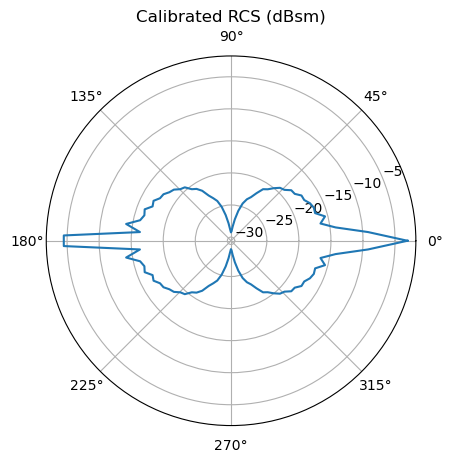
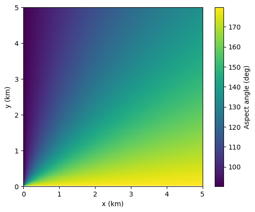
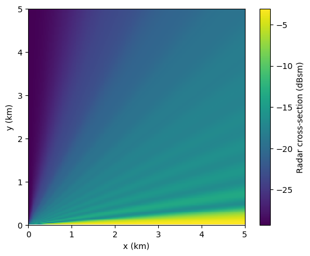
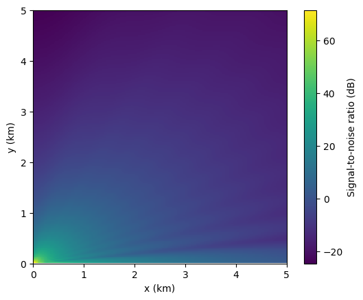
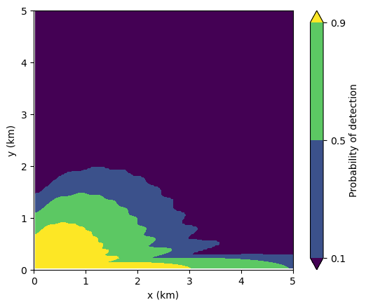
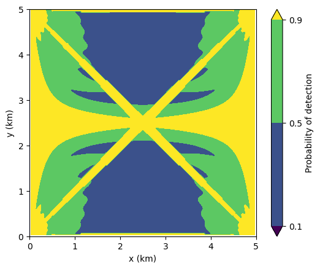

This project develops a Python framework for evaluating radar sensor performance against small uncrewed aerial systems (UAS), emphasizing the geometric advantages of multistatic (distributed) configurations over monostatic baselines. The framework implements monostatic and bistatic radar range equations, Shnidman's detection probability model with Swerling target fluctuation, and an aspect-dependent target radar cross-section model built from composite canonical scatterers and calibrated to published Ku-band small-quadcopter measurements. Outputs include 2D probability-of-detection contours quantifying performance differences between a single monostatic radar and an *N*-node distributed configuration against low-RCS aspect-dependent targets. The study is motivated by the operational importance of counter-UAS radar and the intuition that geometric diversity in distributed sensor networks provides detection coverage that monostatic systems cannot match, particularly against targets with strong aspect-sensitive RCS suppression.

Project code and reproduction notebook following this study are [available](https://github.com/adityakher/multistatic-radar).

### Motivation
Small commercial [UAS](https://en.wikipedia.org/wiki/Unmanned_aerial_vehicle) pose an asymmetric challenge for [radar](https://en.wikipedia.org/wiki/Radar) surveillance: their [RCS](https://en.wikipedia.org/wiki/Radar_cross_section) is low and strongly aspect-dependent, concentrated in directions where monostatic systems can be particularly weak. Distributed ([multistatic](https://en.wikipedia.org/wiki/Multistatic_radar)) radar architectures address this through geometric diversity --- different [transmitter](https://en.wikipedia.org/wiki/Transmitter)-[receiver](https://en.wikipedia.org/wiki/Radio_receiver) pairs view the target from different aspects simultaneously, exploiting [bistatic](https://en.wikipedia.org/wiki/Bistatic_radar) RCS behaviors (including forward-scatter enhancement) that are unavailable to monostatic systems. This project develops a [Python](https://en.wikipedia.org/wiki/Python_(programming_language)) framework for quantifying that geometric advantage in detection performance.

### Approach
We integrate three components: (1) a calibrated aspect-dependent UAS RCS model built from composite canonical scatterers (sphere, plate, cylinder primitives) in the [physical optics](https://en.wikipedia.org/wiki/Physical_optics) regime, anchored to published [Ku-band](https://en.wikipedia.org/wiki/Ku_band) measurements of a small commercial [quadcopter](https://en.wikipedia.org/wiki/Quadcopter); (2) the standard radar range equation in monostatic and bistatic forms; (3) Shnidman's formulation for [fluctuating-target](https://en.wikipedia.org/wiki/Fluctuation_loss) detection probability under Swerling 1 statistics (the appropriate model for small UAS), inverted numerically for *P~d~* contour evaluation.[^shnidman]

Bistatic RCS is handled by the monostatic-bistatic equivalence theorem for general bistatic angles, evaluating the monostatic RCS at the bisector aspect. The forward-scatter regime ($\beta \approx 180\degree$) is treated separately using $\sigma_{FS} \approx 4\pi A^2/\lambda^2$ --- a direct application of [Babinet's principle](https://en.wikipedia.org/wiki/Babinet%27s_principle) to the projected target area.[^skolnik] Non-coherent fusion across pairs is implemented by summing linear [SNRs](https://en.wikipedia.org/wiki/Signal-to-noise_ratio) (the high-SNR limit of the [non-central chi-squared](https://en.wikipedia.org/wiki/Noncentral_chi-squared_distribution) detection statistic), justified by the fact that summed independent chi-squared variables yield combined non-centrality $\lambda = 2\sum{\text{SNR}_i}$.

### Results
We model a small commercial [DJI Phantom](https://www.dji.com/products/phantom)-class UAS as a composite of canonical geometries whose radar cross-sections can be found in the literature.[^ruck] In particular, we model the body as a flat plate, the arms as cylinders, and the rotors as small spheres. For simplicity, we use expressions given for the physical optics regime. At Ku-band, the wavelength is approximately 2 cm, so strictly speaking the physical optics approximation does not apply, especially for the thin arms. In addition, our model assumes all materials are perfectly conductive (and thus reflective), whereas in reality UAS have localized metal along with mostly composite materials. To partially compensate for these effects, we calibrate the result such that the RCS when averaged over aspect angle is equal to a published aspect-averaged RCS for a DJI Phantom 4 Pro.[^ezuma]

{#fig-polar-rcs width=50% fig-alt="Polar plot of radar cross-section in dBsm for a small commercial UAS."}

Detection of the UAS is modeled for a monostatic radar at 15 GHz with transmit power of 1 kW, antenna gain of 30 dBi, noise temperature of 500 K, noise bandwidth of 5 MHz, system losses of 5 dB, and 30 pulse integrations on receive. Signal-to-noise ratio is calculated using the radar equation:[^mitll]

$$\text{SNR} = \frac{P_t\, G^2 \lambda^2 \sigma}{(4\pi)^3 R^4\, k_B T_s\, B_n\, L}.$$

This SNR is then used to determine the probability of detection by numerically inverting Shnidman's empirical formulation for estimating the required SNR for detection given desired *P~d~* and probability of false alarm *P~fa~*. We use the Swerling Level I case of Shnidman's formulation because we expect scan-to-scan fluctuations of the UAS RCS due to rotor blade rotation and quick aspect angle changes. The expected behavior is observed in @fig-mono-pd: *P~d~* is high close to the radar, due to the *R^--4^* target-range dependence of SNR, and in regions where the aspect angle of the target corresponds to a high RCS.

::: {#fig-monostatic layout-nrow=2}

{#fig-mono-aspect fig-alt="Plot of target aspect angle for a radar at origin."}

{#fig-mono-rcs fig-alt="Plot of target RCS for a radar at origin."}

{#fig-mono-snr fig-alt="Plot of target SNR for a radar at origin."}

{#fig-mono-pd fig-alt="Contour plot of probability to detect target for a radar at origin."}

Plots for a target heading in the +*x* direction, with a monostatic radar located at the origin. The result at each (*x*, *y*) position corresponds to the target being at that position. (a) Aspect angle of target. Since the target is headed in the +*x* direction, aspect angle is lowest (broad-side) when its *x*-coordinate is close to zero, and highest (tail-on) when its *y*-coordinate is close to zero. (b) Radar cross-section of target. Broad-side aspect corresponds with a trough in the RCS, as seen in @fig-polar-rcs, and tail-on corresponds with a peak. The peaks and troughs are also responsible for the banding in the plot. (c) Signal-to-noise ratio of target. High SNR is observed close to the radar due to strong range dependence, but SNR is also enhanced for *y* close to zero due to the RCS aspect peak. (d) Probability-of-detection contours. *P~d~* is highest in regions of high SNR.

:::

In a bistatic radar, the transmitter and receiver are located at different positions. The radar equation changes accordingly:

$$\text{SNR} = \frac{P_t\, G_t G_r\, \lambda^2 \sigma}{(4\pi)^3 R_t^2 R_r^2\, k_B T_s\, B_n\, L}.$$

Here, $\sigma$ is the bistatic RCS. For scattering angles $\beta$ (*i.e.*, the angle between the target-to-transmitter vector and the target-to-receiver vector) less than 180&deg;, the RCS is equivalent to the monostatic RCS at an aspect corresponding to the bisector of the scattering angle. However, RCS is enhanced for $\beta \approx 180\degree$ due to forward scattering. The angular cutoff for the forward-scattering regime is given by $\theta_{FS} \approx \lambda/l$, where *l* is a characteristic side length of the target.[^kulpa] In our case, at 15 GHz, $\lambda \approx 2\;\text{cm}$; for a target characteristic length of ~35 cm (rotor-to-rotor diagonal of a Phantom-class quadcopter), $\theta_{FS} \approx \lambda/l \approx 3\degree$, giving a ±3&deg; window around the $\beta = 180\degree$ line.

{#fig-bistatic width=50% fig-alt="Contour plot of probability of detection for target with bistatic radar."}

We show the probability of detection for a bistatic configuration in @fig-bistatic. The two antennae have identical parameters. Although there is strong enhancement along the corridor between them, local *P~d~* is reduced when compared to the monostatic case in @fig-mono-pd. This is because when *R~t~* is small, *R~r~* is large, and vice versa. Note that with identical antenna parameters, the radar equation is symmetric when switching transmitter with receiver. We verified this symmetry by computing the role-reversed configuration, which produces an identical detection contour, providing a consistency check on the geometry implementation.

What if we add additional antennae at the other two corners of the scene? This would result in a 4-node radar network, where each pair of nodes constitutes a bistatic radar. Combining independent bistatic looks at the target is analogous to non-coherent pulse integration in a single receiver. Thus, in the high-SNR regime (*i.e.*, where $P_d \gtrsim 0.5$, which are the regions of interest), the linear SNRs corresponding to each bistatic pair can be added together to determine the overall network SNR.

{#fig-network width=50% fig-alt="Contour plot of probability of detection for target with 4-node radar network."}

Enhanced *P~d~* coverage is apparent in @fig-network due to both the additional forward-scatter corridors between pairs and the greater combined SNR from pairwise summing. It also appears that there are no more regions with *P~d~* < 0.1 remaining in the scene; however, caution is warranted in regions where individual pair SNRs fall below ~3 dB, where the high-SNR approximation underlying linear SNR summation begins to break down and proper non-coherent integration loss factors become significant. It should also be noted that the system-level enhancement is only possible with a centralized processor that has access to signal and noise information from each node.

In practice, the network could be operated in [MIMO](https://en.wikipedia.org/wiki/MIMO) fashion, where rather than unordered bistatic pairs, the pairs are effectively ordered into (transmitter, receiver) and vice versa by all nodes simultaneously transmitting orthogonal waveforms and then receiving from every other node. This doubles the number of bistatic looks, resulting in a factor of 2 improvement in the combined SNR. We have chosen the more conservative unordered-pairs framework for our calculations.

### Discussion
We have shown that target detection can be significantly enhanced by using a distributed *N*-node radar architecture in comparison with monostatic and bistatic paradigms, due to SNR enhancement from forward-scattering and from summing SNRs from each bistatic pair for the combined system SNR. We have not discussed target localization in this project. In fact, bistatic configurations degrade target localization relative to monostatic --- the target position resulting from a detection can be anywhere on an ellipse with foci at the two antenna locations. However, multi-node networks with *N* &geq; 3 can triangulate between different pairwise detections, finding intersections between multiple bistatic ellipses to localize targets. Thus, the power of multistatic radar is not limited to detection enhancement.

As mentioned above, these advantages are only possible with centralized processing. It also requires very precise pulse timing and synchronization between nodes. These requirements --- centralized fusion across coherent, time-synchronized nodes --- are the defining design constraints of coherent distributed radar networks currently being developed for counter-UAS applications. Note that the system in our study, which only exploits non-coherent combining, would have somewhat looser fusion processing requirements.

In addition to these challenges, there are a number of other limitations we have not considered. We have not modeled clutter, atmospheric effects, or terrain --- our model is on two-dimensional Euclidean space. Our radar cross-section model is also greatly simplified and uses assumptions including the perfect electrical conductor and physical optics approximations that may not be valid. An RCS model derived from measurements and/or a high-fidelity electromagnetics solver would yield more accurate results.

### Follow-On Directions
Developing and using a high-fidelity RCS model is one possible direction for advancing this work. We could also model clutter or add terrain and a *z*-dimension for the target. We could model coherent processing instead of just non-coherent. Doppler processing could be used for rotor signatures and to validate the Swerling fluctuator model assumption. The work could also be extended beyond detection to tracking, including track fusion across node pairs. Finally, we could extend to multi-band radar operation.

[^skolnik]: M. I. Skolnik, *Introduction to Radar Systems*, 2nd ed. New York: McGraw-Hill, 1980.
[^shnidman]: D. A. Shnidman, "Determination of required SNR values [radar detection]," in *IEEE Transactions on Aerospace and Electronic Systems*, vol. 38, no. 3, pp. 1059-1064, July 2002, doi: [10.1109/TAES.2002.1039422](https://doi.org/10.1109/TAES.2002.1039422).
[^ruck]: G. T. Ruck, D. E. Barrick, W. D. Stuart, C. K. Krichbaum, *Radar Cross Section Handbook*. New York: Plenum Press, 1970.
[^ezuma]: M. Ezuma, C. K. Anjinappa, M. Funderburk and I. Guvenc, "Radar Cross Section Based Statistical Recognition of UAVs at Microwave Frequencies," in *IEEE Transactions on Aerospace and Electronic Systems*, vol. 58, no. 1, pp. 27-46, Feb. 2022, doi: [10.1109/TAES.2021.3096875](https://doi.org/10.1109/TAES.2021.3096875).
[^mitll]: R. M. O'Donnell, "Introduction to Radar Systems," MIT Lincoln Laboratory. [Online]. Available: <https://www.ll.mit.edu/outreach/web-based-course-radar-introduction-radar-systems>. [Accessed: May 11, 2026].
[^kulpa]: K. Kulpa, P. Samczyński, P. Krysik, B. Salski, P. Kopyt, and M. Malik, "Forward Scattering Effect Exploitation in Passive Radars," Warsaw University of Technology, Tech. Rep. AFRL-AFOSR-UK-TR-2019-0051, AFOSR Grant FA9550-17-1-0041, Sep. 2019.